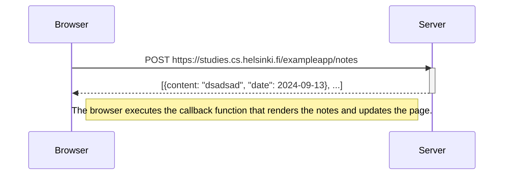

# Sequence Diagram

```mermaid
sequenceDiagram
    participant Browser
    participant Server

    Browser->>Server: POST https://studies.cs.helsinki.fi/exampleapp/notes

    activate Server
    Server-->>Browser: [{content: "dsadsad", "date": 2024-09-13}, ...]
    deactivate Server

    Note right of Browser: The browser executes the callback function that renders the notes and updates the page.

```
